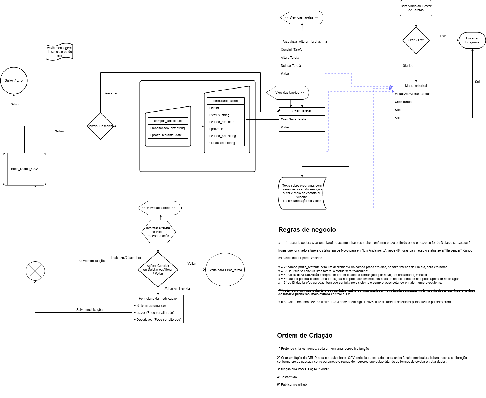
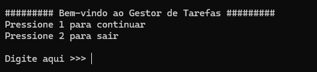
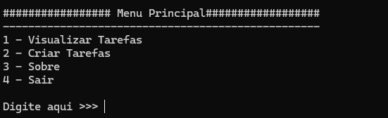
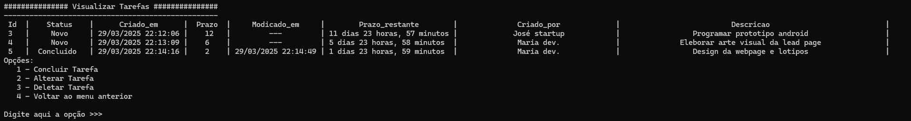
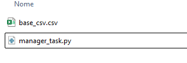

# 🏗️ Gerenciador de Tarefa Backend
## Sistema de tarefas em backend para desenvolvimento de conhecimento e absorção de práticas funcionais

Este projeto tem por finalidade a pratica de fundamentos procedurais e logica de programação usando funções basicas da linguagem escolhida para este fim.

Objetivo: Dominar os conceitos procedurais e logica, utilizando como desafios apenas os seguintes Tópicos:
-	Variáveis, Tipos de Dados, Operadores
-	Estruturas de Controle (if, for, while)
-	Funções e Módulos
-	Listas, Tuplas, Dicionários e Conjuntos
-	Manipulação de Arquivos CSV
-	Tratamento de Exceções

# 🚀 Tecnologias Utilizadas
- **Python**
- **Outros Ferramentas:**
  - **Draw.io - app.diagrams.net** (Ferrameta criação de design de UML e diagramas)
  - **Frontend:** Utilize o prompt da sua escolha para executar o sistema no windows: powershell/CMD e Linux use terminal de sua escolha.
  - 
# 🗺️Arquitetura e Design do projeto, regras de negocios
## Sistema em backend, com estrutura de monolito, com base para persistir dados em arquivo CSV


# 🎲 Como usar o sistema
## 1. Clone o repositório:
```bash
git clone https://github.com/zantech-pro/gerenciador_tarefa_backend.git
```
## 2. Execute o Sistema:
```bash
python manager_task.py
```
# 🖥️ Capturas de Tela
**Tela de Bem-Vindo do sistema**<br/>


**Tela de Menu Principal do sistema**<br/>


**Tela de Visualização do sistema**<br/>


**Após rodar o sistema aparecera a base CSV**<br/>


📌 Funcionalidades

✅ Implementação de algoritimo de ordenação com base em coluna da base de dados em CSV

✅ Manipulação de CSV para leitura, escrita, alteração, remoção de registro (CRUD)

✅ Manipulação de dados para visualização amigavel

✅ Utilização de biblioteca time para criação de carimbo de data/hora, subtração de datas/hora 


📜 Licença
Este projeto foi feito com carinho e é de uso pessoal. Caso tenha interesse, entre em contato!

Meu telegram: [@zandermais](https://t.me/zandermais)

📧: dev@zantech.com.br

